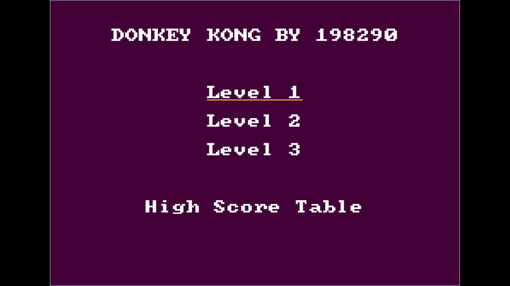
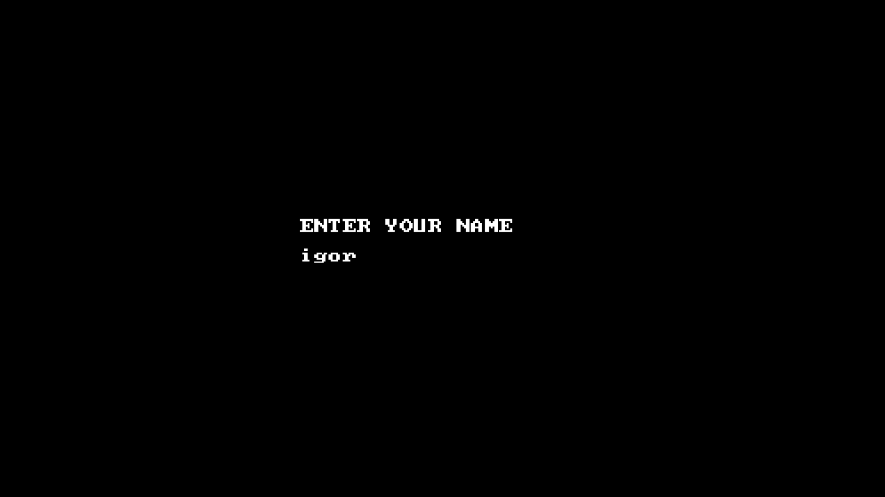
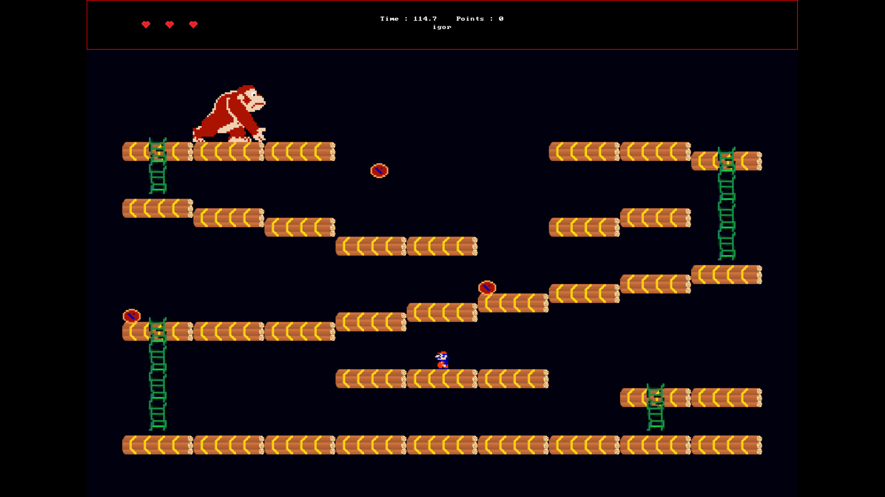
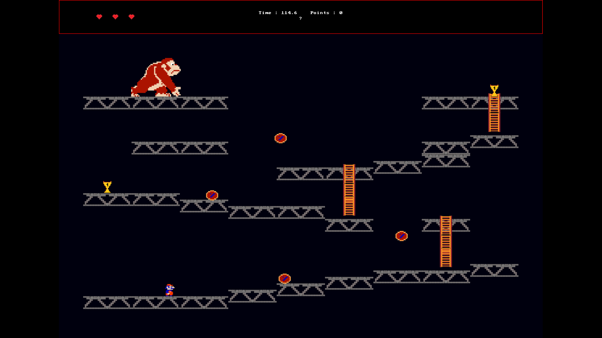
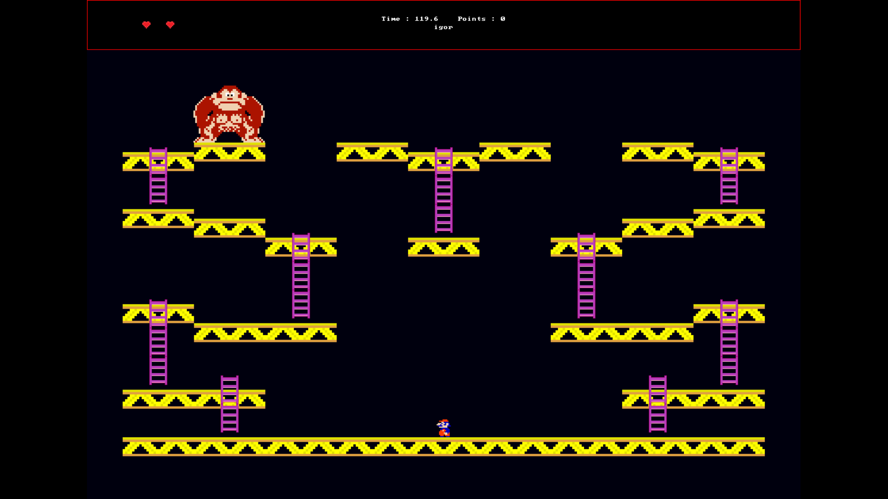
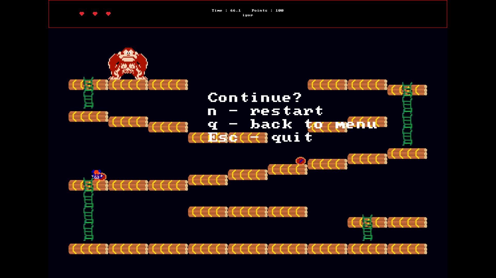
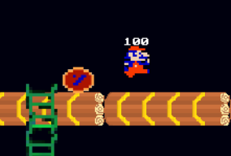
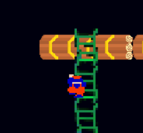

# Donkey Kong – C++ Implementation

Implementation of Donkey Kong in C++ (more like C, but with `const int` instead of `#define`), using SDL2 for graphics.

## How to Run

### Option 1: Visual Studio (Simplest and working thanks to MSVC)

1. Clone this repository.
2. Open the `.sln` file in **Visual Studio** – the project is already included.
3. Be aware that `SDL2.dll` is a x86 DLL – running it with an x64 compiler configuration won't work.

### Option 2: CMake (Cross-platform)

1. Ensure you have **SDL2 2.0.10** downloaded. You can get it here: [SDL2 2.0.10 Release](https://github.com/libsdl-org/SDL/releases/tag/release-2.0.10).
2. Place the extracted SDL2.2.0.10 file in the project directory (next to CMakeLists.txt). 
3. From SDL root, build the static SDL library:

```bash
mkdir build && cd build
cmake .. -DCMAKE_POLICY_VERSION_MINIMUM=3.5 # this is and older SDL release - therefore we need to downgrade
cmake --build .
```

4. Copy the newly created static lib to the projec root:
```bash
cp libSDL2.a ../../src/
```

5. From the project root, create a build directory and configure with CMake:

```bash
mkdir build && cd build
cmake ..
cmake --build .
```

6. Move to the final build directory:
```bash
cd bin
```

7. Run the game:

```bash
./bin/DonkeyKong2
```

---

## Screenshots

### Main Menu



### Name Entering



### Gameplay

Game features 3 levels:

**Level 1**  


**Level 2**  


**Level 3**  


### ☠️ Death Screen



---

## Bonus Effects

The game features:
- Animations for both the main character and the enemy.
- Display of awarded points for picking up trophies and dodging barrels.

<p align="center">
  
  
</p>

